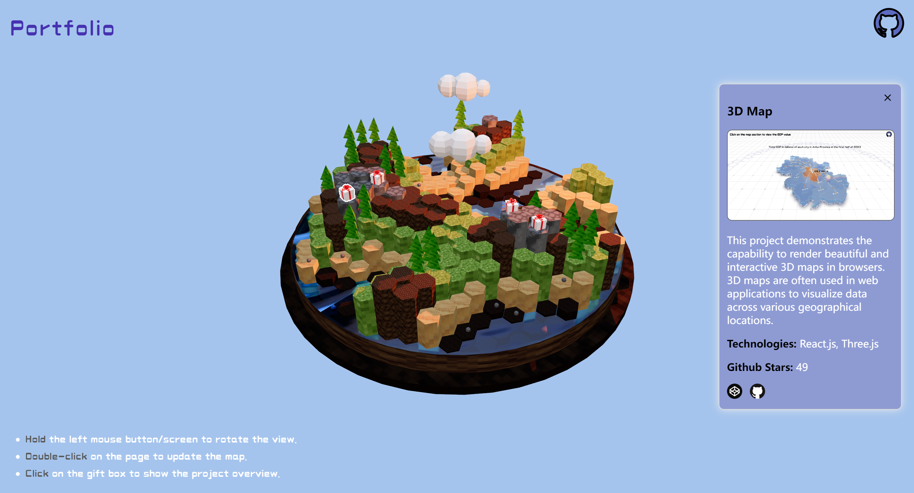

## My Portfolio

Making websites interactive is cool, so I decided to build my portfolio in a way that lets you explore it like a game.

**PC Overview**

**Mobile Overview**

There are some simple operating instructions:

- Hold the left mouse button/screen to rotate the view.
- Double-click on the page to update the map.
- Click on the gift box to show the project overview.
- Click on the icons in the information card to visit the project demo page and the GitHub repository.

🔗 Live link: [portfolio](https://portfolio-xiaoguabushigua.vercel.app/)

🔗 Inspired by: https://www.youtube.com/watch?v=HsCYEA_UuZA&t=17s